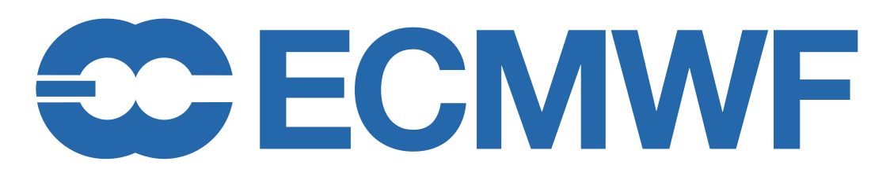

| :warning: This project is BETA and will be experimental for the foreseeable future. Interfaces and functionality are likely to change. DO NOT use this software in any project/software that is operational. |
| ------------------------------------------------------------------------------------------------------------------------------------------------------------------------------------------------------------ |

<h3 align="center">

</br>

# covjsonkit

<p align="center">
  <a href="https://github.com/ecmwf/covjsonkit/actions/workflows/ci.yaml">
  
</a>
  <a href="https://codecov.io/gh/ecmwf/covjsonkit"></a>
  <a href="https://opensource.org/licenses/Apache-2.0"></a>
  <a href="https://github.com/ecmwf/covjsonkit/releases"></a>
</p>
<p align="center">
  <a href="#concept">Concept</a> •
  <a href="#installation">Installation</a> •
  <a href="#example">Example</a> •
  <a href="#testing">Testing</a>
</p>

## Concept

Covjsonkit is an ECMWF library for encoding and decoding coverageJSON files/objects of meteorlogical features such as vertical profiles and time series.

* Encodes and decodes CoverageJSON objects
* Convert CoverageJSON files to and from xarray
* Works in conjunction with ECMWFs Polytope feature extraction library

Current features implemented:

* Time Series
* Vertical Profile
* Bounding Box
* Frame
* Path
* Wkt Polygons
* Shapefiles

## Installation

Install the covjsonkit with Python 3 (>=3.7) from GitHub directly with the command

    python3 -m pip install git+ssh://git@github.com/ecmwf/covjsonkit.git@develop

or from PyPI with the command

    python3 -m pip install covjsonkit

## Example

The library consists of an encoder and a decoder element. The decoder can be used to decode valid coverageJSON files that can be then be edited and accessed via the api. It can also be used to convert to ther formats such as xarray.

### Decoder

```Python
from covjsonkit.api import Covjsonkit

decoder = Covjsonkit().decode(coverage.covjson)

print(decoder.type)
print(decoder.parameters)
print(decoder.get_referencing())

ds = decoder.to_xarray()
```


### Encoder

The following example encodes data output from the polytope feature extraction library assuming polytope_output is a valid output from polytope.

```Python
from covjsonkit.api import Covjsonkit

encoder = Covjsonkit().encode("CoverageCollection", "BoundingBox")
res = encoder.from_polytope(polytope_output)
```

### Config

Covjsonkit uses a config to determine what parameter metadata to use, an example can be found in [example_config.json](example_config.json). This will automatically be loaded at runtime to point to the correct parameter metadata files. 

The example config has to be stored in one of the following places:

1. System-wide configuration in /etc/covjsonkit/config.json (and yaml)
2. User configuration in ~/.covjsonkit.json (and yaml)

Users can add their own parameter metadata in the [data directory](covjsonkit/data/) by add ing a new directory containing a param.json, param_id.json, and units.json in a format the same as can be found in [ecmwf directory](covjsonkit/data/ecmwf/). Then edit the config to point to your newly named directory.

If users want to pass in their own config tehy can do this as a python dictioanry in the following way:

```Python
encoder = Covjsonkit(cf).encode("CoverageCollection", "BoundingBox")
```

Where `cf` is a valid covjsonkit config.
## Testing

Python unit tests can be run with pytest:

    python -m pytest 

When a pull request is merged into develop or main a github actions CI pipeline is triggered to test formatting and unit tests.
